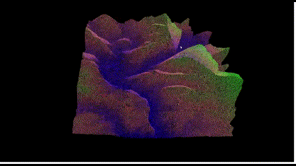

# Height Map Rendering

<div align="center">
  
</div>

## Overview

**Height Map Rendering** is an OpenGL-based project designed to visualize height fields in three-dimensional space. It serves as a hands-on introduction to 3D graphics programming and rendering techniques, providing users with the tools to create visually appealing and interactive height fields. This project demonstrates how to handle height maps, apply textures, render scenes in different modes (points, wireframes, or solid surfaces), and interact with the rendered 3D object.

A height field is a visual representation of a scalar function that takes two-dimensional coordinates as input and returns a height value. This project simplifies the rendering process by discretizing the function into a grid of points and approximating the surface with triangles.

---

## Features

This project includes the following functionality:

- **Height Map Rendering**: Visualize a height field represented as a grayscale image.
- **Rendering Modes**: Switch between rendering modes:
  - Points
  - Wireframe
  - Solid triangles
- **Interactive Controls**:
  - Rotate the height field using mouse input.
  - Move the height field in the viewport.
  - Scale the height field dynamically.
- **Color Mapping**:
  - Use height-based smooth gradients for coloring vertices.
  - Optionally use texture mapping to enhance visualization.
- **Perspective View**:
  - Enable depth buffering for accurate hidden surface removal.
  - Interactively deform the landscape.
- **Performance**:
  - Handle images up to 768x768 resolution while maintaining interactive frame rates on a 1980x1280 window.

---

## Installation

This project requires Python and its associated dependencies. We recommend using `conda` for managing the environment:

```bash
conda env create -f environment.yml
conda activate height_map_rendering
```

---

## Running the Project

To start the project, run the following command:

```bash
python main.py --window_width 800 \
               --window_height 600
```

This command creates a window of size 800x600 pixels and initializes the renderer which then ipnuts the user to interactively select the height map image.

---

## Implementation Details

The following key components form the backbone of the project:

- **Height Map Loading**: Load height map data from an image file to generate the height field.
- **Vertex Data Generation**: Create vertex positions and color data based on the height map.
- **Model Transformation**: Handle transformations such as scaling, rotation, and translation of the height field.
- **Rendering Pipeline**: Use OpenGL shaders to render the height field in different modes.
- **Camera Projection**: Generate and apply perspective transformation matrices.

---

## Controls and Interaction

- **Mouse Controls**:
  - Rotate: Drag with the left mouse button.
  - Move: Drag with the middle mouse button.
  - Scale: Scroll up/down.
- **Keyboard Shortcuts**:
  - `1`: Render as points.
  - `2`: Render as wireframe.
  - `3`: Render as solid triangles.

---

## Free Tips for Exploration

- **Depth Buffer Precision**: Ensure the near and far clipping planes are positive. A good range is [0.01, 10].
- **Z-Buffer Stretching**: Avoid over-stretching the z-buffer to maintain visual precision.
- **Optimization**: Use `numpy` with explicit data types for efficient numerical computations.
- **Creativity**: Experiment with different height maps, textures, and animations to showcase unique results.

---

## Showcase

The project supports creative animations and visualizations. Whether it’s realistic landscapes, abstract designs, or interactive animations, the possibilities are endless. Share your results as GIFs or videos to demonstrate the power of your visualization!

---

## Acknowledgments

Special thanks to the starter code that provided the framework for this project, and the OpenGL community for their extensive resources and support.