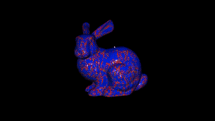
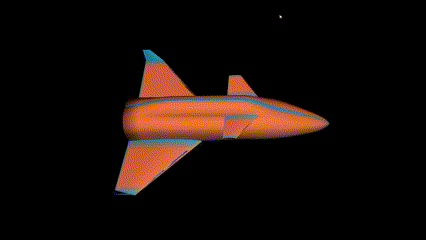
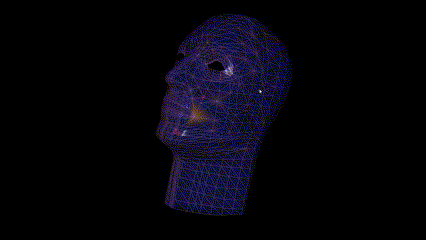
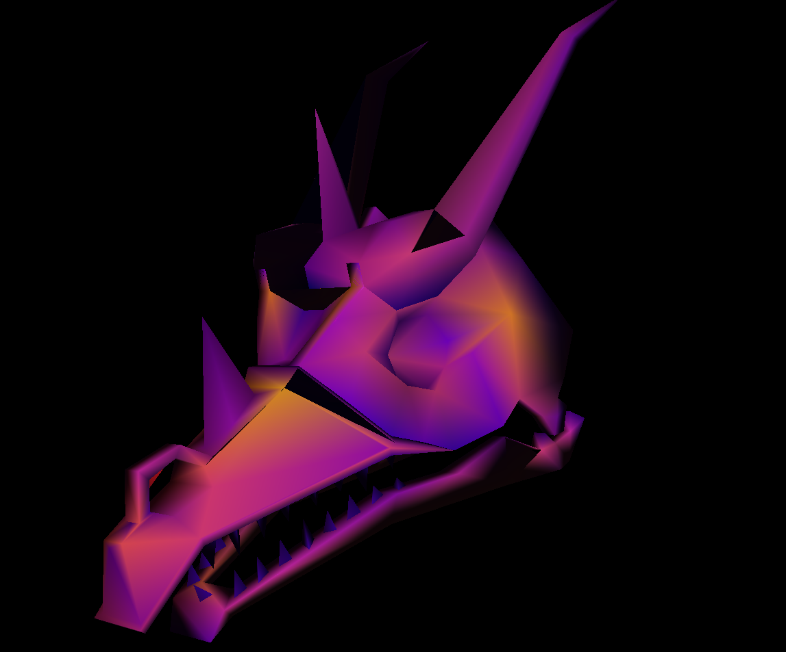
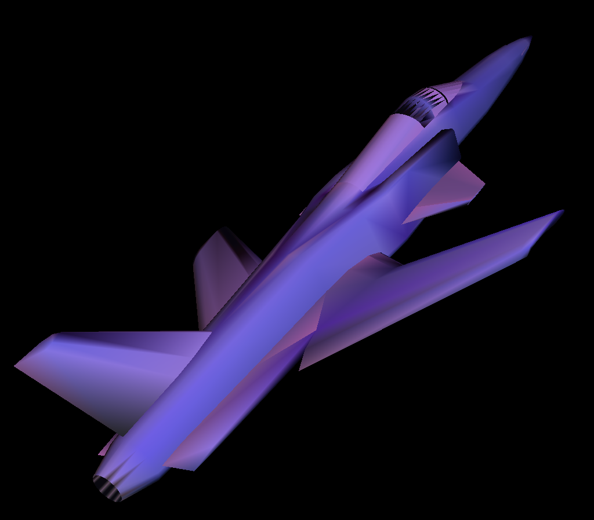
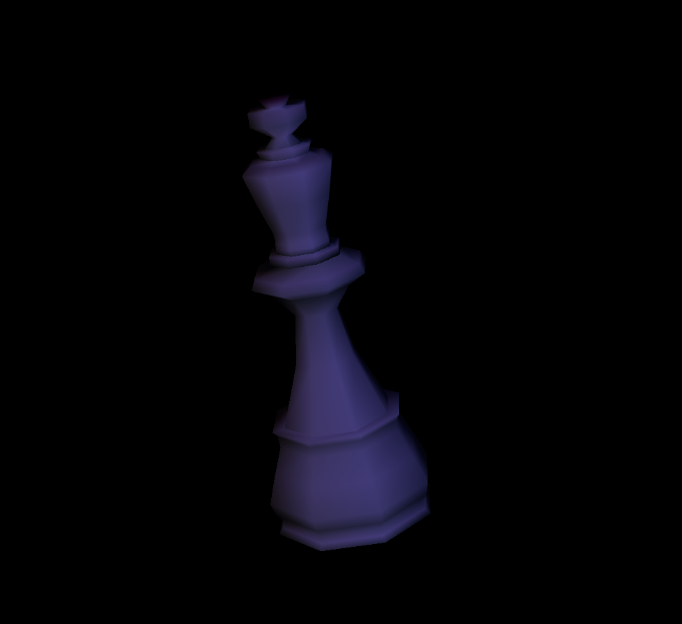
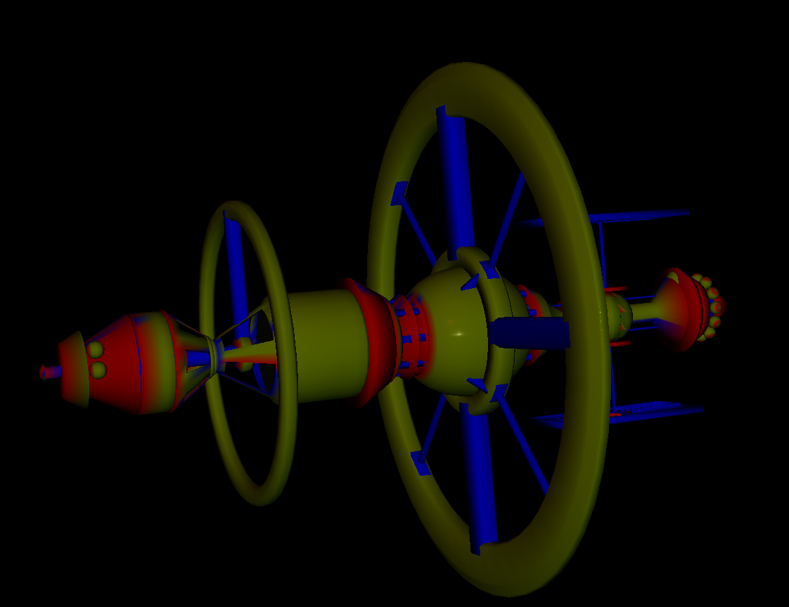

# Assignment #2 
<div align="center" style="position: relative; display: inline-block;">
  
  <div style="position: absolute; top: 90%; left: 8%; transform: translate(-20%, -50%); color: yellow; font-size: 15px; font-weight: bold;">
    Overview sample
  </div>
</div>
<div align="center" style="position: relative; display: inline-block;">
  
  <div style="position: absolute; top: 90%; left: 8%; transform: translate(-18%, -50%); color: yellow; font-size: 15px; font-weight: bold;">
    Brightness control
  </div>
</div>
<div align="center" style="position: relative; display: inline-block;">
  
  <div style="position: absolute; top: 90%; left: 8%; transform: translate(-18%, -50%); color: yellow; font-size: 15px; font-weight: bold;">
    Colormap switch
  </div>
</div>


## Introduction
This is a mesh processing framework implemented using a simple vertex valence visualization of a mesh using OpenMesh.

The valence v(x<sub>i</sub>) of a vertex x<sub>i</sub> in a triangle mesh is the number of vertices in the 1-ring neighborhood N(x<sub>i</sub>) of x<sub>i</sub>. In particular, the vertices of N(x<sub>i</sub>) are connected with an edge to x<sub>i</sub>.

The provided functionalities of this mesh viewer is:
- **Zoom in/out**: The user can scale the mesh by scrolling the middle mouse button.
- **Rotation**: User can rotate the mesh by dragging the mouse while holding the left button.
- **Rendering mode (Wireframe/Hidden Line/Solid Flat/Solid Smooth/Vertex Valences)**: The application can render the mesh with different modes. The "vertex valences" mode will be implemented by you. The modes are implemented by buttons `1`, `2`, `3`, `4`. The Vertex Valences mode is supposed to be by `5`.
- **Performance testing**: When pressing `f`, the application will run a performance test.

## Additional Features
The following additional functionalities have been implemented to enhance the mesh viewer:

- **Load Mesh**: Load any .OFF mesh file using a pop-up window at the start of the program.
- **Brightness Control**: Increase or decrease the brightness of the mesh using the `up` and `down` arrow keys.
- **Colormap Switching**: Press `x` to switch and play between 12 different colormaps.
- **Mesh Testing**: Experimented with over 10+ different .OFF mesh files to ensure robustness and versatility. Assets are available in `data/Models/`.

<div align="center">
  
  
  
  
  <p style="font-size: 18px; font-weight: bold; color: yellow;">Visualization with more meshes</p>
</div>

## Installing Dependencies
We highly recommend to use conda environment. The dependencies are provided in: `requirements.txt`. 

## Run Your Code
You can run the code by the following command:
```
python main.py --window_width 800 \
               --window_height 600
```

<!-- ## Tasks
Your task is to build the "Vertex Valences" rendering mode. To do so, you have to fill the two missing functions:
- `calc_valences` in `mesh_viewer.py`: This function calculates all the valences of each vertex.
- `color_coding` in `mesh_viewer.py`: Having the valences of all the vertices, now you have to map them to a color map, e.g. Jet Color, or the one we provided in `data/colors.png`. -->

<!-- ## Free Tips
- You may need to calculate the maximum and minimum valences.
- You can use any color map that you want, or just use the color map we provided in `data/colors.png`. If you use a customized color map, describe it in the readme file.
- Feel free to modify any part of the code, but remember to describe your changes in the readme file. -->

<!-- ## We Value Creativity!
Well, the assignment is pretty simple. Try to find a way to make your homework distinguish. For example, you can add more features to the program, or use another meshes, etc. We will give you some credit scores (up to 10%) if we think your program is intesting. -->

## Showcase

The project supports creative animations and visualizations. Whether it’s realistic landscapes, abstract designs, or interactive animations, the possibilities are endless. Shared the results as GIFs or videos to demonstrate the power of your visualization!

---

## Acknowledgments

Special thanks to the starter code that provided the framework for this project, and the OpenGL community for their extensive resources and support.