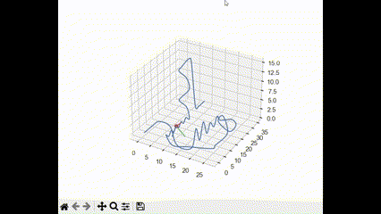

# Roller Coaster Simulation using OpenGL

## Overview
This project implements a **roller coaster simulation** using **Catmull-Rom splines** for smooth track generation and **OpenGL** for rendering. The simulation includes a **first-person view**, real-time animation, texture mapping, and interactive controls.

## Sample

    
    

        Sample GIF
    

    
    

        Spline GIF
    

    
    

        Facebox Face
    

    
    

        Ground Face
    

## Features
- **Track Generation:** Uses **Catmull-Rom splines** to generate a smooth railway track.
- **Frenet Frames (TNB):** Ensures smooth camera orientation along the track.
- **OpenGL Rendering:** Implemented with **vertex, fragment, and geometry shaders**.
- **Texture Mapping:** Textured ground and sky for a realistic environment.
- **Railway Modeling:** Cylindrical rails with cross-sections.
- **Interactive Camera Controls:** Navigate the scene using input controls.
- **Performance Optimization:** Runs at **≥30 FPS**.

## Implemented Assignment Questions/Codeblocks
- `Spline._catmul_rom` in `spline.py`: Extract the four control points, Catmull-Rom spline basis matrix coefficients, Returns the calculated position on the spline.

- `Spline.__call__` in `spline.py`: Calculate the position of a Catmull-Rom spline for a given parameter t. This method handles the general case with more than 4 control points.

- `sloan_method` in `spline.py`: Calculate the TNB (Tangent, Normal, Binormal) frames for a given set of points.

- `BoxFaceEntity._build_vertex_data` in `world_box_entity.py`: Generating OpenGL data for a single face of the world box by building the vertex data required for rendering a single face of the world box.

- `WorldBoxEntity.__init__` in `world_box_entity.py`: Calculating the model transforms for the world faces, Initializes the WorldBoxEntity with sky and ground textures and calculates the model transforms for the world faces.

- `WoodenTieEntity._build_vertex_data`: Build vertex data, including position, texture coordinate, and the drawing indices.

- `WoodenTieEntity.draw` in `railway_entity.py`: Ensure the shader program is used and the vertex array object is bound before drawing.

- `RailwayEntity.__init__` in `railway_entity.py`: Load the points representing the spline and create the right railway line.

- `RailwayEntity.draw` in `railway_entity.py`: Uniformly spaced the ties along the railway by create a single wooden tie and draw it multiple times along the railway, similar to the world box.

- `RailwayEntity.get_camera_along_railway` in `railway_entity.py`: Calculate the camera extrinsics along the railway that returns the view matrix.

- `shaders/wooden_ties.vert` and `shaders/wooden_ties.frag`: wooden_tiles.vert calculate the fragment position, normal vector, and texture coordinates for each vertex. wooden_tiles.frag copmutes positions and normals of the fragments, along with light and view positions, to compute the lighting.

- `rotate` function in `shaders/railway_line.geo`: Implemented code rotates the vector x along the axis of rotation n by an angle of alpha (in radian).

## File Structure
- `spline.py` - Implements **Catmull-Rom splines** and Frenet frames.
- `app.py` - Main application logic and simulation loop.
- `base_entity.py` - Handles **OpenGL entity rendering**.
- `world_box_entity.py` - Manages the world box entity, including sky and ground textures.
- `railway_entity.py` - Manages the railway entity, including track generation and rendering.
- `shaders/` - Contains GLSL shader programs.
- `textures/` - Stores texture images for ground and sky.
- `assets/` - Contains additional assets like sample GIFs and images.

## Controls
- `W/A/S/D` - Move the camera
- `Mouse` - Look around
- `Esc` - Exit simulation

## License
This project is open-source and available under the MIT License.

