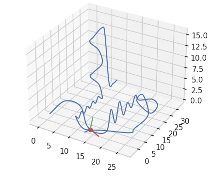

# Assignment #3
## Introduction
In this assignment, you will use Catmull-Rom splines along with OpenGL to create a roller coaster simulation. The simulation will run in a first-person view, allowing the user to "ride" the coaster in an immersive environment.

Now that the first two programming assignments have familiarized you with working in OpenGL, this assignment asks you to utilize some more interesting features of the library in the design of a more significant and more entertaining application. In addition, this project gives you a great deal more freedom to be creative in the actual design of your program and the features that go into it; you are asked to create your own solutions to issues involved in the making of your simulation, and to render your coaster as you wish in a world of your design.

After completing this assignment, you should have a solid understanding of:
- **Splines**
- **Texture maps** and their use in OpenGL
- **Geometry shader** -- Unlike the previous two assignments, only vertex and fragment shaders would not be enough. In this homework, you will know how to use geometry shader.
- **Camera manipulations** --the use of transformations to create realistic first-person movement

This assignment should be challenging, at least as much as the first two assignments and likely more. However, it should also be a lot of fun! Please start early.

## Installing Dependencies
You can re-use the conda environment from the first two assignments.

## Compile Your Code
You can run the code by the following command:
```
python main.py --sky_texture_path ./assets/textures/sky.png \
               --ground_texture_path ./assets/textures/ground.png \
               --ties_texture_path ./assets/textures/ties.png \
               --railway_path ./assets/spline_data/goodRide.sp \
               --window_width 800 \
               --window_height 800
```
This command loads the textures for the sky, ground, and the wooden ties of the railway from the texture paths. The railway is defined from the points given in the `railway_path`. The window for the application has size `800x800`.


## Tasks
Your task is to create a roller coaster simulation using OpenGL. You'll need to render a spline sequence which represents the entire length of your track. In order to do so, you will need to implement a function that takes four control points (p0 through p3) and a floating point value (u) from 0 to 1, and computes the corresponding position on the spline segment defined by these four control points. Drawing a single spline from four control points isn't that exciting--you'll need to use several control points in sequence and draw spline segments along them, starting from the first four points and proceeding until you draw the final spline for the last four points. This will allow you to represent a long, elaborate curve for your coaster. In this exercise, we will use Catmull-Rom splines for the representation of your coaster. More details can be found in latter sections.

The assignment can be divided into 5 main subtasks:
- **Level 1 (spline)**: First, please implement your spline function and draw some splines to the screen. A point on a single Catmull-Rom spline segment is given by:

    $p(u) = [u^3 \quad u^2 \quad u \quad 1] \times M \times C \qquad (1)$

    where M is the Catmull-Rom spline basis matrix, C is the control matrix, and parameter u varies on the interval [0,1]. The exact form of the formula can be found [here](http://www.mvps.org/directx/articles/catmull/).

    To render the spline, you may use the simplest "brute-force" method where you vary the parameter u by some fixed value, for example 0.001. Insert each value of u into equation (1) (above), to obtain the point location $p(u)$. For example: $u = 0.0, 0.001, 0.002, ..., 0.999, 1.0$. Having the spline, you can now draw the railway lines, which consists of two paralell lines. Unlike the classic OpenGL, you cannot just simply use GL_LINES and vary the line width. You will have to draw the spline as a pipe. This is when the geometry shader becomes handy. The idea here is that for every two consecutive points on the spline, you draw a cylinder connecting the two points. To draw such cylinder, you will need to samples samples $N$ points on two parallel circles with the two points as the center, and then draw multple triangles two connect these $2N$ points. Please look into `shaders/railway_line.geo` shader for more details.

    Note that in order to see the spline, you must setup your OpenGL camera. For a start, you can just use a stationary camera You may use the keyboard/mouse to view the scene from different angles. We provide a set of "track" files containing control points to define some simple splines, and starter code to read in a sequence of these files and convert them to sequences of control points that you can use. You can safely assume that each spline file (i.e. `spline_data/*.sp`) has at least 4 control points. You are encouraged to experiment with .sp files, creating your own spline files as needed for your personalized solution (well-documented creativity will be awarded).

- **Level 2 (ground)**: Next, add the ground. You can use a plane for the ground. It should be texture-mapped for realism with an image of your choice. There are plenty of free texture online, for example, [Unity assess store](https://assetstore.unity.com/popular-assets--skyboxes#free-skyboxes-Ts73), so find one that appeals to you. Note that you may need to rescale your texture image to be of dimension that is a power of 2. For example, good choices are 256x256 or 512x512. You can use any software you wish to scale and/or edit your texture image. For Linux user, we recommend GThumb.

- **Level 3 (sky)**: After this, create your sky--this should also be texture-mapped, and the method of modeling it is up to you. For example, one way to create the sky is to enclose the entire scene into a cube, which is the default way supported by the starter code, and then texture-map the faces of this cube with some sky-like texture. Note, however, that there are issues (e.g., visible seams) with many obvious representations, so you can improve this for extra credit (but don't do it until you are done with all the levels). Make sure that you can still draw the splines as before once you have done levels 2 and 3!

- **Level 4 (the ride)**: Now, implement the ability to ride the coaster. You can do so by moving your camera at a constant speed (in u) along the spline (creating physically realistic motion is extra credit). Properly orienting your camera is a challenging problem! You'll want to have your camera facing "forward" (along the tangent to your spline) as it moves. The tangent vector can be computed by differentiating equation (1) with respect to u, that is: $t(u) = p'(u) = [3u^2 \quad 2u \quad 1 \quad 0] \times M \times C$. Note that you need to normalize this vector to obtain a unit length tangent. Also, you need to make the "up" vector of your camera follow some continuous path of normals to the spline. A cheap method to decide your up vector is to always set it equal to the normal of your ground plane--however, this is very unrealistic for many splines.

- **Level 5 (rail cross-section)**: Modify the appearance of the coaster itself: instead of just a line, make your track look like a track, by rendering a cross-section of the rail. In order to render the cross-section, you can use the tangent, normal and binormal described in Level 4. Suppose p0 and p1 are two consecutive points along the spline. You can then compute vertices $v_0, v_1, ..., v_7$, and render a tube as described in the **Free Tips** section.

After this is all done, add some fun extras! Do not attempt extra credit until you have successfully finished everything else, or else you run the risk of running out of time. Your final implementation must satisfy the followings:
- Complete all levels.
- Properly render Catmull-Rom splines to represent your track.
- Render a texture-mapped ground and sky.
- Render a rail cross-section.
- Move the camera at a reasonable speed in a continuous path and orientation along the coaster.
- Render the coaster in an interesting manner (good visibility, realism).
- Run at interactive frame rates (>30fps at 800x800).
- Be reasonably commented and written in an understandable manner--we will read your code.
- Be submitted along with the illustration video for the required animation (see below).
- Be submitted along with a readme file documenting your program's features and describing the approaches you took to each of the open-ended problems we posed here (rendering the sky and determining coaster normals in particular). This is especially crucial if you have done something spectacular for which you wish to receive extra credit!

Below is an example of a solution, with several extra credit elements. Of course, this is just an example; your solution will likely differ. This image is not a standard for grading or meant to show what you need to do. The text in this README gives the official (and only) rules for the assignment requirements.


This assignment is much more open-ended as to what you may choose to implement for extra credit. You may be awarded credit for any creative or interesting solution to an issue in your implementation, as long as it is well-documented in your readme file. Below are some ideas you might want to think about if you have the time:
- Render a T-shaped rail cross-section.
- Render double rail (like in real railroad tracks).
- Make your track circular and close it with C1 continuity (small credit, i.e., 1 point).
- Add OpenGL lighting to make your coaster look more realistic.
- Draw additional scene elements: texture-mapped wooden crossbars, a support structure that looks realistic, decorations on your track, something interesting in the world nearby, etc.
- Create tracks that mimic real world roller coasters.
- Generate your track from several different sequences of splines (multiple track files), so you can shuffle these around and create a random track.
- Draw splines using recursive subdivision (vary step size to draw short lines) instead of using brute force (vary u with fixed step size).
- Render the environment in a better (prettier, more efficient, more interesting, etc?) manner than described here.
- Decide coaster normals in a better manner than described here.
- Modify the velocity with which your camera moves to make it physically realistic in terms of gravity.- Derive the steps that lead to the above physically realistic equation.

***Please note that the amount of extra credit awarded will not exceed 20% of the assignment's total value.***


## Starter Code Instructions

You will need to fill these methods/functions. Please check the comment of each function which contains the description and hints:

- `Spline._catmul_rom` in `spline.py`: Calculate the position of a Catmul-Rom in case there is only 4 points.
- `Spline.__call__` in `spline.py`: Calculate the position of a Catmul-Rom in the general case.
- `sloan_method` in `spline.py`: Calculate the TNB frames.
- `BoxFaceEntity._build_vertex_data` in `world_box_entity.py`: Generating OpenGL data for a single face of the world box.
- `WorldBoxEntity.__init__` in `world_box_entity.py`: Calculating the model transforms for the world faces.
- `WoodenTieEntity._build_vertex_data`: Build OpenGL data for wooden ties.
- `WoodenTieEntity.draw` in `railway_entity.py`: Draw function for wooden ties.
- `RailwayEntity.__init__` in `railway_entity.py`: Load the points representing the spline and create the right railway line.
- `RailwayEntity.draw` in `railway_entity.py`: Write the drawing logic for the wooden ties.
- `RailwayEntity.get_camera_along_railway` in `railway_entity.py`: Calculate the camera extrinsics along the railway.
- `shaders/wooden_ties.vert` and `shaders/wooden_ties.frag`: You need to write these two shaders from scratch.
- `rotate` function in `shaders/railway_line.geo`: Rotation function used in the railway line geometry shader. You need to understand the logic of this shader before writing this function.


    Please check predefined variables so that you don't have to redefine them again.


## Free Tips (Will make your life much easier!!!)
### General tips
- Make sure the starter code works on your machine.
- Start this assignment as soon as you can. It is a significant endeavor, with many intermediate steps. If you wait until a few days before the assignment is due, you probably will not finish. This project is a lot of fun if you're not rushed, and if enough time is put in the end product is something fun that you can show off to your friends.
- Experiment with your own ideas, and have fun.
- ***If you stuck somewhere, contact the TAs for necessary assistance.***
### How to construct the railway
As we mentioned, the railway is represented by a Catmull-Rom spline. After constructing the spline, you also have to move a car along this spline. To do so, the camera must have orientation which can be formulated by three orthogonal vectors and this orientation must be changed in a realistic manner when moving on the spine. One way to achieve this is to use the NTB space.

'NTB' is an 'on curve' coordinate system, consisting of orthogonal vectors T (curve tangent), N (curve normal) and B (curve "binormal", obtained via TxN). Creating an NTB coordinate 'frame' at each timestep of your animation is the best way to orient your car along the coaster track (and have it tilt and turn correctly as the track winds and loops around). Such an NTB frame is called a 'Frenet frame’.

Here is a visualization (T - red; N - green; B - blue):



Calculating T is rather easy (via the curve's derivative). N is trickier - but we can start with an initial guess, and use it to get a good starting point. B is simply the cross product of T and N. Only for the very first point in the calculated chain of points, instead of starting with T and N to calculate B, it seems better to start with T and B, and derive N from those (again, via cross product). Once we have a starter set (ie. our first NTB triplet), we could calculate further NTB sets incrementally. Such incremental propagation guarantees that the NTB frame won't wildly 'flip' around at regions of severe normal change (not calculating NTB incrementally, eg. computing it explicitly for each point, could result in this hard-to-fix problem). The NTB flipping issue is described in details [here](https://dhal.com/downloads/resources/PathsForVolumeSlices.pdf). This method of calculating T, N, and B is called Sloan's method. Exact equations can be found [here](http://www.cs.cmu.edu/afs/andrew/scs/cs/15-462/web/old/asst2camera.html).

We provide the visualization tool for you in `spline.py` to test and visualize the NTB implementation. You should use this tool to debug the spline first before incoporate it into your main code.

### Moving the camera
Like an FPS, the goal is to place the camera on the moving car to get a first-person rider POV. Given that we already have the NTB frame, the easiest way to create the view matrix is to create a LookAt Matrix. You can use [Pyrr](https://pyrr.readthedocs.io/en/latest/api_matrix.html) to create this matrix.

### Drawing coaster tracks
You need eight vertices to draw a cuboid that spans the two end ("rail") CatmullRom curves - four verts (forming a SQUARE cross section) on the left (using the yellow-colored BTN (specifically, B,T) axes, centered at a curve point), and four corresponding verts on the right. Using the 8 verts you can draw 6 quads (2 end squares, 4 middle rectangles) to produce a single ‘slat'.

How would you form a square at a curve point on either track? Easy:
```
vert0 = curvePoint
vert1 = curvePoint+T
vert2 = curvePoint+T+B
vert3 = curvePoint+B
```
To get the other square, repeat the above on the other side, with the corresponding curvePoint that's across.

Given the close spacing of the curve points, it's likely that the slat cuboids would OVERLAP. To fix the problem (ie. to create thin slats that have gaps between them), just scale the squares down appropriately, by identically scaling the T and B vectors using a <1 scale factor (you'll need to find a good value by trial and error):
```
// might need to set 's' bigger/smaller than 0.01..
s = 0.01
vert0 = curvePoint
vert1 = curvePoint+(s*T)
vert2 = curvePoint+(s*T)+(s*B)
vert3 = curvePoint+(s*B)
```

Another problem that can occur (depending on track configuration) is this: in high curvature areas (eg. where drops are situated), your second (offset) track might loop back on itself, ie. create an unwanted pinch/bubble/loop. How would you fix it? Simple - instead of using the normalized N to locate the track (which creates an inter-track spacing of 1 by definition), use a scaled down value, eg. 0.5N.
