# Ray Tracer - Assignment Solution

## Introduction
In this assignment, I implemented a ray tracing renderer that handles opaque surfaces with lighting and shadows using GLSL shaders. The goal was to build a ray tracer that could generate rays, compute intersections, and apply Phong illumination along with shadowing. The final solution is a fully functional ray tracing system that renders scenes with spheres and triangles, applying appropriate lighting and shading effects.

## Results - Without Additional Credit Features
<div align="center" style="position: relative; display: inline-block;">
    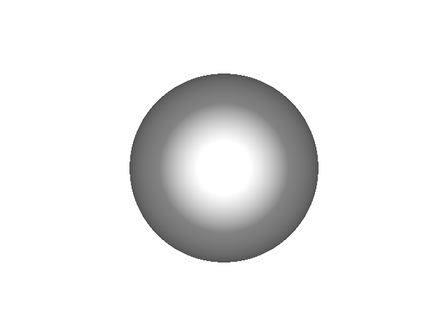
    <div style="position: absolute; top: 90%; left: 8%; transform: translate(-20%, -50%); color: yellow; font-size: 15px; font-weight: bold;">
    </div>
</div>
<div align="center" style="position: relative; display: inline-block;">
    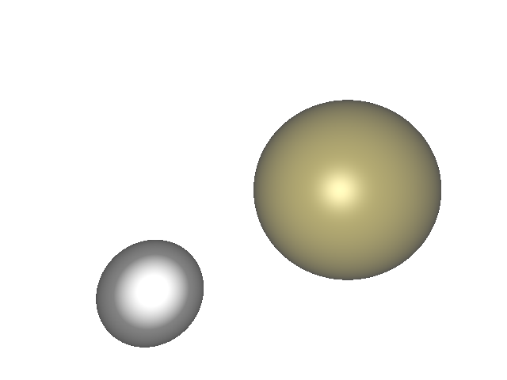
    <div style="position: absolute; top: 90%; left: 8%; transform: translate(-18%, -50%); color: yellow; font-size: 15px; font-weight: bold;">
    </div>
</div>
<div align="center" style="position: relative; display: inline-block;">
    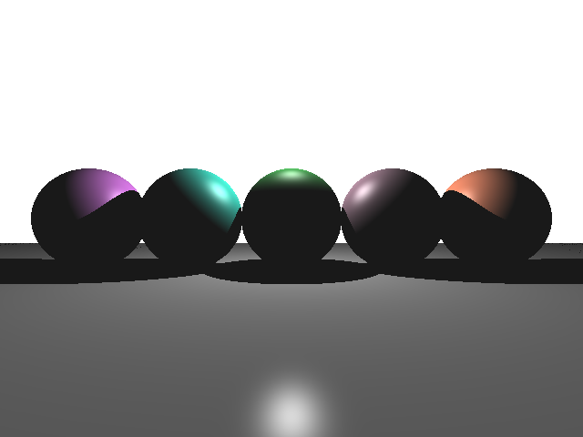
    <div style="position: absolute; top: 90%; left: 8%; transform: translate(-18%, -50%); color: yellow; font-size: 15px; font-weight: bold;">
    </div>
</div>
<div align="center" style="position: relative; display: inline-block;">
    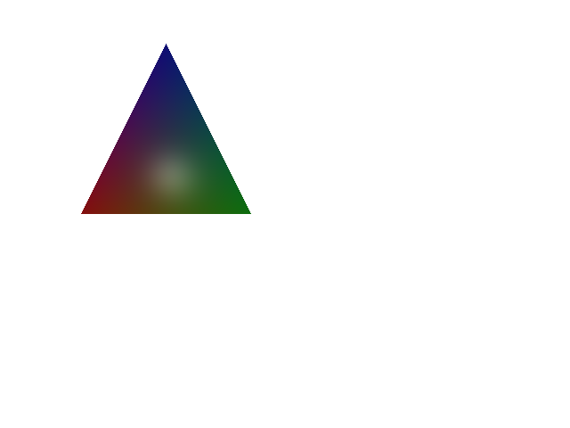
    <div style="position: absolute; top: 90%; left: 8%; transform: translate(-18%, -50%); color: yellow; font-size: 15px; font-weight: bold;">
    </div>
</div>
<div align="center" style="position: relative; display: inline-block;">
    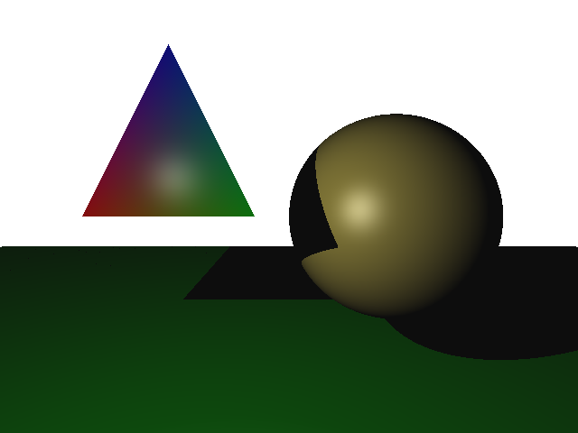
    <div style="position: absolute; top: 90%; left: 8%; transform: translate(-18%, -50%); color: yellow; font-size: 15px; font-weight: bold;">
    </div>
</div>

## Results - With Additional Credit Features (Zoom-In for better details):
- Recursive Reflection
- Anti-Aliasing
- Soft Shadows
<div align="center" style="position: relative; display: inline-block;">
    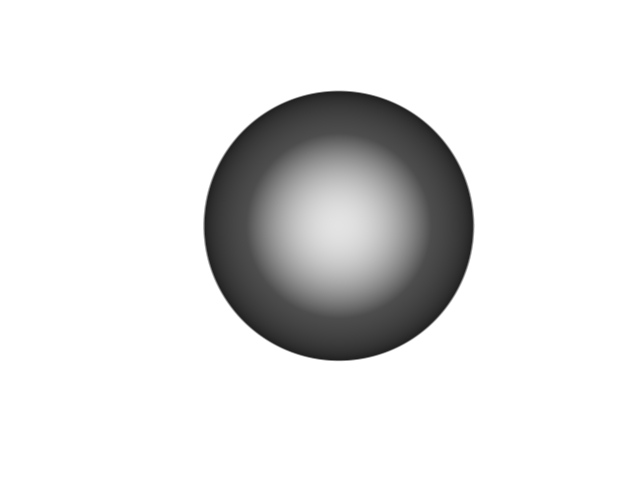
    <div style="position: absolute; top: 90%; left: 8%; transform: translate(-20%, -50%); color: yellow; font-size: 15px; font-weight: bold;">
    </div>
</div>
<div align="center" style="position: relative; display: inline-block;">
    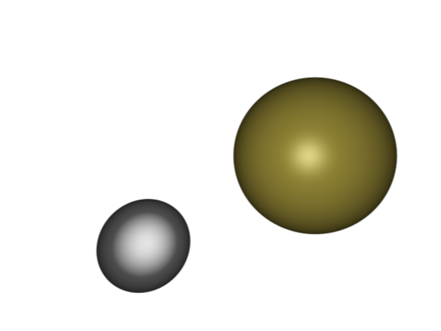
    <div style="position: absolute; top: 90%; left: 8%; transform: translate(-18%, -50%); color: yellow; font-size: 15px; font-weight: bold;">
    </div>
</div>
<div align="center" style="position: relative; display: inline-block;">
    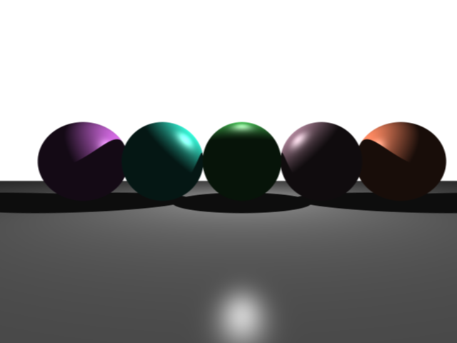
    <div style="position: absolute; top: 90%; left: 8%; transform: translate(-18%, -50%); color: yellow; font-size: 15px; font-weight: bold;">
    </div>
</div>
<div align="center" style="position: relative; display: inline-block;">
    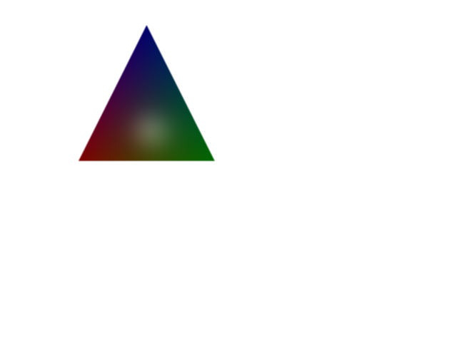
    <div style="position: absolute; top: 90%; left: 8%; transform: translate(-18%, -50%); color: yellow; font-size: 15px; font-weight: bold;">
    </div>
</div>
<div align="center" style="position: relative; display: inline-block;">
    
    <div style="position: absolute; top: 90%; left: 8%; transform: translate(-18%, -50%); color: yellow; font-size: 15px; font-weight: bold;">
    </div>
</div>

## Ablations across different Antialiasing samples (Zoom-In for better details):
Line 44 in `fragment_shader.frag`: const int ANTIALIASING_SAMPLES
<div align="center" style="position: relative; display: inline-block;">
    
    <div style="position: absolute; top: 90%; left: 8%; transform: translate(-20%, -50%); color: red; font-size: 15px; font-weight: bold;">
    Without Antialiasing
    </div>
</div>
<div align="center" style="position: relative; display: inline-block;">
    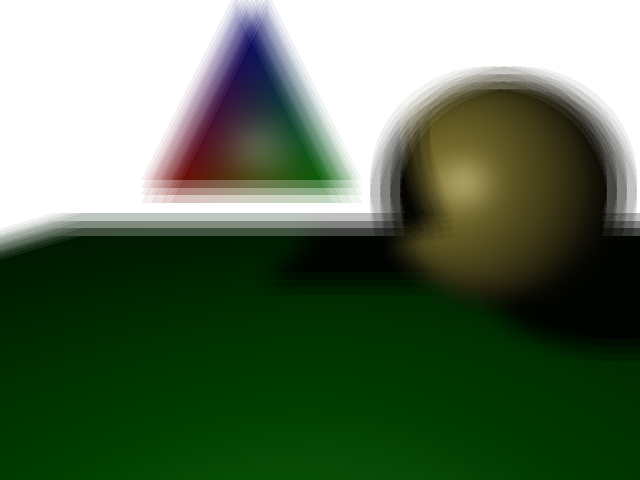
    <div style="position: absolute; top: 90%; left: 8%; transform: translate(-18%, -50%); color: yellow; font-size: 15px; font-weight: bold;">
    With 4 Antialiasing Samples
    </div>
</div>
<div align="center" style="position: relative; display: inline-block;">
    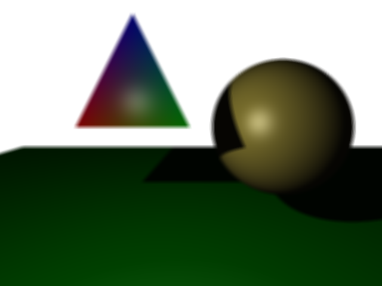
    <div style="position: absolute; top: 90%; left: 8%; transform: translate(-18%, -50%); color: yellow; font-size: 15px; font-weight: bold;">
    With 8 Antialiasing Samples
    </div>
</div>
<div align="center" style="position: relative; display: inline-block;">
    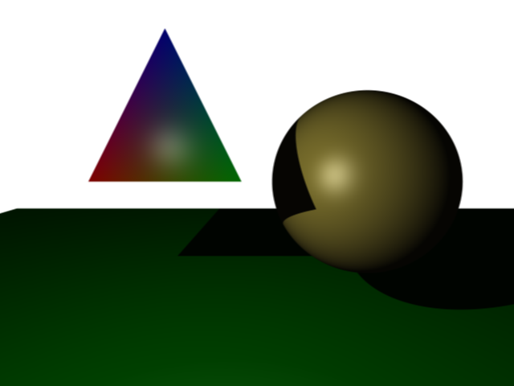
    <div style="position: absolute; top: 90%; left: 8%; transform: translate(-18%, -50%); color: yellow; font-size: 15px; font-weight: bold;">
    With 16 Antialiasing Samples
    </div>
</div>
<div align="center" style="position: relative; display: inline-block;">
    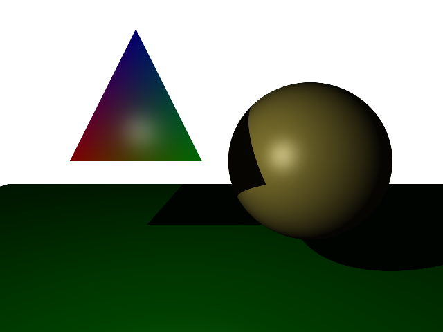
    <div style="position: absolute; top: 90%; left: 8%; transform: translate(-18%, -50%); color: yellow; font-size: 15px; font-weight: bold;">
    With 32 Antialiasing Samples
    </div>
</div>

## Tasks
- **Ray Generation**: Implemented ray generation in the fragment shader. Rays are cast from the camera location (0,0,0) through the pixel corresponding to each fragment in the image, with the normalized device coordinates (NDC) adjusted by aspect ratio and field of view (FOV).
  
- **Intersection Calculations**:
  - **Ray-Sphere Intersection**: Implemented the mathematical solution for ray-sphere intersection, handling intersection checks between rays and spheres using the quadratic formula.
  - **Ray-Triangle Intersection**: Implemented ray-triangle intersection using barycentric coordinates for more accurate intersection checks between rays and triangles.

- **Phong Shading Implementation**:
  - Applied **Phong illumination** for shadingon both spheres and triangles, incorporating ambient, diffuse, and specular components.
  - Included shadow rays for detecting if a point lies in shadow relative to each light source. If the point is in shadow, the color contribution from that light is black, otherwise, Phong shading is applied.

- **Additional Features**:
  - **Recursive Reflection**: Implemented recursive reflection to simulate mirror-like surfaces, allowing for reflections in both spheres and triangles.
  - **Anti-Aliasing**: Added anti-aliasing using multiple samples per pixel for smoother results, especially around object edges.
  - **Soft Shadows**: Introduced soft shadows by sampling aaround the light source to simulate penumbra effects.

## Scene Rendering
The ray tracer was tested with various scene files, and the results were rendered with the following commands:

```bash
python main.py --scene_path ./scenes_data/test_single_sphere.scene
python main.py --scene_path ./scenes_data/test_double_sphere.scene --save_path ./outputs/test_double_sphere.png
python main.py --scene_path ./scenes_data/test_triangle.scene --save_path ./outputs/test_triangle.png
```

## Code Breakdown
The solution was divided into the following major components:

1. **Shader Programs**:
   - **Vertex Shader**: Handles the passing of geometry data to the fragment shader.
   - **Fragment Shader**: Contains the ray tracing logic, including ray generation, intersection checks, and Phong shading. This is where the ray-sphere and ray-triangle intersections were implemented.
   
2. **Utility Classes**:
   - `Vec3`: A utility class for 3D vector operations such as dot product, cross product, and normalization.
   - `Scene`: Loads scene data including spheres, triangles, lights, and ambient light.

3. **Application Logic**:
   - **App Setup**: Responsible for setting the camera, window dimensions, and FOV, and passing scene data to the shaders.
   - **Scene Data**: All scene files (e.g., `test_single_sphere.scene`, `test_triangle.scene`) are structured to define the 3D objects and lighting.

4. **Ray Tracing Logic**:
   - Intersection functions (`sphere_intersect`, `triangle_intersect`) determine whether a ray hits a sphere or triangle, using geometric computations.
   - Phong shading is applied by computing lighting based on the angle of incidence and reflection.

## Improvements & Extra Credit

1. **Recursive Reflection**
    - Implemented using an iterative approach to avoid GLSL recursion issues.
    - Maximum of 3 reflection bounces.
    - Rays accumulate color contributions at each bounce.
    - Properly handles reflection attenuation based on surface reflectivity.

2. **Antialiasing**
    - N×N supersampling grid (N^2 samples per pixel).
    - Subpixel jittering for higher quality edge smoothing.
    - Proper averaging of all samples for the final color.

3. **Soft Shadows**
    - 16 random samples per light source for soft shadow calculation.
    - Properly distributes samples over the light surface using a disk distribution.
    - Creates an orthonormal basis to properly position shadow samples.
    - Returns a floating-point shadow factor for subtle shadow gradients.

## Conclusion
The assignment was successfully completed with all core tasks (ray generation, intersections, Phong shading, and shadowing) implemented correctly. Extra features like recursive reflections, anti-aliasing, and soft shadows were added to enhance the visual quality of the rendered scenes. This project allowed me to gain hands-on experience with ray tracing techniques, GLSL shader programming, and the complexities involved in simulating realistic lighting effects.