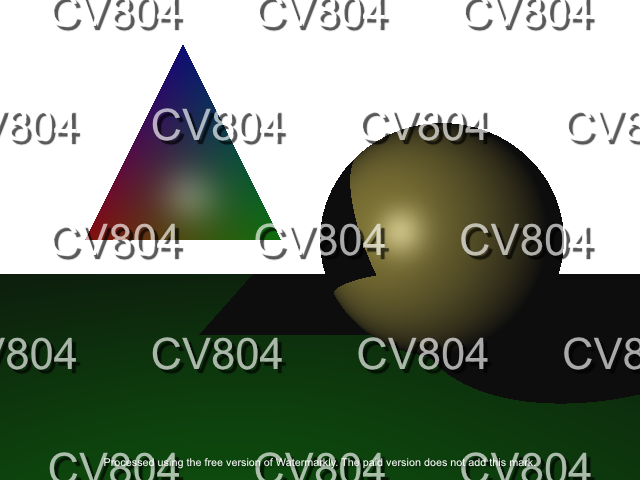

# Assignment #4
## Introduction
In this assignment, you will be building a ray tracer. Your ray tracer will be able to handle opaque surfaces with lighting and shadows. Provided for you will be starter code that will load scene data from a file.

For this assignment, you will implement a ray tracing renderer using GLSL shaders. This involves writing shader code to handle ray generation, intersections, lighting, and shadow computations. The starter code simplifies much of the setup, allowing you to focus on the core ray tracing logic.

After completing this assignment, you should have a solid understanding of:
- How to generate rays in a shader and use uniform variables for camera properties.
- How to implement Phong Illumination in GLSL.
- How to implement geometric operators, e.g. calculating intersections, reflections, barycentric coordinates etc.
- How to use shadow rays to simulate shadowing.

Similar to the previous assignment, this homework is pretty challenging (and fun!). Therefore, we advise to start early and seek for helps from TAs if you have any issue. **DO NOT** wait until the very end of the deadline and request for extention. There will be no extention and your score will be deducted.

## Installing Dependencies
You can re-use the conda environment from the previous assignments.

## Compile and Run Your Code
To run the code, use the following command to render a scene and display it on the screen (e.g., `./scenes_data/test_single_sphere.scene`):
```
python main.py --scene_path ./scenes_data/test_single_sphere.scene
```

To save the result to a file, provide the `--save_path` argument:
```
python main.py --scene_path ./scenes_data/test_single_sphere.scene --save_path ./results/test_single_sphere.png
```

You will have to render all the scenes given in `./scenes_data`. You can run the above command for each scene file or use the provided `run_all.py` script to automate rendering. Results will be saved in `./results`.


## Tasks
The ultimate goal is to build a ray tracer. To do so, your task can be divided into four steps:
- **Step 1:** Send out rays from the camera location. In this assignment, ray generation is handled in the fragment shader (`fragment_shader.frag`). The camera position is passed as a uniform (`camera_pos`), assumed to be at (0,0,0). Rays are generated per fragment using normalized device coordinates (NDC) adjusted by the aspect ratio and field of view (FOV). The final images should be 640x480, but you can adjust `--window_width` and `--window_height` for debugging with smaller resolutions (fewer fragments = faster rendering). The FOV is fixed at 80 degrees, and you should set the `fov_tan` uniform in `app.py`.

- **Step 2:** Write the intersection code in the fragment shader. You’ll implement ray-sphere and ray-triangle intersection functions (`sphere_intersect` and `triangle_intersect`). The mathematical solutions for the intersection code are provided in the lecture notes or in the instructions pdf attached to this repo.

- **Step 3:** Implement the Phong illumination equations in the fragment shader. At each intersection point, you need to first determine if it is in shadow, separately for each light source. You do this by launching a shadow ray to each of the lights. If the point is in shadow, its color with respect to that light should be (0,0,0), that is, black. If the point is not in shadow, use Phong shading to determine the color of the point with respect to that light:

    $I = C_a + C_l * \left(k_d (L \cdot N) + k_s (R \cdot V)^{sh}\right)$

    where:
    - C_a is the ambient light;
    - C_l is the color of the light source;
    - k_d and k_s are the the diffuse and specular reflection constants, respectively;
    - L is the direction vector from the point on the surface toward the light source;
    - N is the normal vector on the surface;
    - V is the direction vector from the surface to the camera;
    - R is the reflected vector of L at the point on the surface.

    The final color of the point is the sum of the contributions from all lights, plus the global ambient color. You only add the global ambient color once, regardless of how many lights the scene has, and regardless of how many lights are visible from the point. Note that it could happen that a point is in shadow with respect to all lights. In this case, the final color will be the global ambient color. Or a point could be in shadow with respect to some lights, but not others. Or, all lights may be visible from a point. If the final color is greater than 1.0, you should of course clamp it to 1.0.

     For triangles, interpolate normals, diffuse, specular, and shininess using barycentric coordinates (implemented in `barycentric`). For spheres, compute the normal from the intersection point and sphere center.

- **Step 4:** Create still images showing off your ray tracer. The starter code handles rendering and saving automatically. Run `python main.py` with the appropriate arguments for each scene in `./scenes_data`, or use an automated script. Submit the rendered images along with your code in the end.

This is the list of requirements for this assignment:
- Triangle intersection (20 points)
- Sphere intersection (20 points)
- Triangle Phong shading (15 points)
- Sphere Phong shading (15 points)
- Shadows rays (15 points)
- Still images (15 points)

After you implemented all the required functionalities, your output should look similar to the following image (without the watermarks of course):



You can also implmenent some extra features to get credit scores. Below are some suggestions (but not limited to):
- Recursive reflection (10 points)
- Good antialiasing (10 points)
- Soft shadows (10 points)
- Animation (5 points)
- Animation + Motion blur (15 points)

Please note that the amount of extra credit awarded will not exceed 20% of the assignment's total value.


## Starter Code Instructions
Similar to previous assignments, we also provide a starter code which already implemented a few basic elements:
- `utils.py`: Contains the `Vec3` class for 3D vectors (with operators like dot, cross, normalize) and utility functions for shader compilation. No implementation required here.
- `scene.py`: Represents the scene, loading primitives (spheres, triangles), lights, and ambient light from a file. No implementation required.
- `app.py`: Sets up the OpenGL context, loads the scene, and passes data to the shader via uniforms. You need to implement:
    - Setting the fov_tan uniform using an 80-degree FOV.
- `fragment_shader.frag`: The core ray tracing logic resides here. You need to implement:
    - `sphere_intersect(vec3 ro, vec3 rd, vec3 center, float radius)`: Calculate ray-sphere intersection.
    - `triangle_intersect(vec3 ro, vec3 rd, Triangle tri)`: Calculate ray-triangle intersection.
    - `barycentric(vec3 p, vec3 a, vec3 b, vec3 c)`: Compute barycentric coordinates for triangle interpolation.
    - `phong_shading(vec3 pos, vec3 normal, vec3 diffuse, vec3 specular, float shininess, vec3 view_dir, Light light)`: Compute Phong illumination for a point.


## Free Tips
- Check carefully the provided starter code. We already implemented almost every basic stuff so you should not waste your time reinventing the wheel.
- Check the hints given in the code, could be very useful.
- Debug with smaller window sizes (using `--window_width` and  `--window_height`) to speed up rendering.
- Test incrementally with provided scenes:
    - `test_single_sphere.scene`: Debug sphere intersection and Phong shading.
    - `test_double_sphere.scene`: Verify multiple object handling.
    - `test_triangle.scene`: Debug triangle intersection and shading.

- For triangle intersections, compute the plane normal using a cross product of two edges in `triangle_intersect`. Use the vertex normals (interpolated via `barycentric`) for Phong shading to achieve smooth highlights.
- Clamp negative dot products (e.g., $L \cdot N$ or $R \cdot V$) to 0 in `phong_shading`, as they indicate no contribution (light below horizon or view far from reflection).
- Handle floating-point precision with `EPS` (e.g., `t > EPS` instead of `t > 0`) to avoid artifacts.
