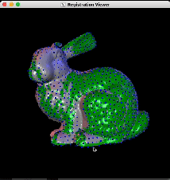

# Assignment #5

## Introduction
In this assignment, you will build a rigid surface registration applications that can register multiple input meshes interactively. After completing this assignment, you should have a solid understanding of basic surface registration alogrithms including point-to-point and point-to-plane distance minimization.

A complete implementation should look similar to the below example when running on the first four bunny meshes:



The GUI supports many functionalities:
- **Register the source mesh (the green mesh):** Pressing `r` or `SPACE` triggers the application to register the source mesh using the point-to-point or point-to-plane algorithm, respectively.
- **Interactive initialization:** Users can provide an initial registration by holding `SHIFT` and using mouse controls to manually rotate the source mesh.
- **Load the next mesh:** Pressing `n` advances to the next mesh for registration.
- **Visualize sampled points:** Blue dots represent sampled points on the source mesh.

## Installing Dependencies
You can re-use the conda environment from the second assignment.

## Running Your Code
To run the application, use the following command:
```
python main.py --output_file save_path path_to_mesh_1 path_to_mesh_2 ... path_to_mesh_n
```
- `save_path`: Path to the file where the registered points will be saved, for example, `results/output.txt`
- `path_to_mesh_i`: Path to the $i^{th}$ mesh file.

The program requires at least two mesh paths as input; otherwise, it will raise an error. You must align all 10 bunny meshes provided in `./data` and submit the output file saved at `save_path`.

## Tasks
In this assignment, your task is to implement two basic surface registration algorithms: point-to-point and point-to-plane distance minimization. This can be divided into the following small steps:

### Step 1: Sampling Points
Both point-to-point and point-to-plane algorithms require a set of matching points to perform an optimization step. Therefore, the first step of both methods is to sample a set of points on the source mesh (the moving mesh) and then find their closest point on the target mesh (the static mesh). In the starter code, we already implemented the closest point matching using Kd Tree so you only need to implement the source point sampling part. 
- **Sample points on the source mesh:** Implement uniform sampling in `RegistrationViewerApp.subsample` such that the average distance between sampled points is approximately equal to `subsample_radius`. This constraint limits the number of points to improve optimization speed.
- **Find closest points:** The starter code uses a KD-tree (`ClosestPoint` class with SciPy's `KDTree`) to find the closest points on the target mesh, so you only need to focus on sampling.

### Step 2: Rejecting Bad Pairs
The selected pairs could be noisy and consequently hurt the optimization. In this step, you will reject the bad pairs based on the following criterias in `RegistrationViewerApp.calculate_correspondences`:
- **Distance thresholding:** If the two matched points are too far to each other, they could be just noise and need to be removed. In the starter code, the threshold is fixed as the median of all the distances of the pairs multiplied by 3.
- **Normal compatibility:** If the angle between the normals at the two matched points are too big (for example, more than 60 degree), the pair is possibly a noise and needed to be rejected.
- **Matchted points at the border:** If one of the point in the pair is on the border of the target mesh, the pair should also be rejected. This criteria is already implemented in the starter code.

### Step 3: Point-to-Point Registration
Given the matched pairs, the point-to-point algorithm register two surfaces by iteratively solving for the rigid transformation that minimize the distance between the pairs. Specifically, let $(p_1, q_1), (p_2, q_2), ..., (p_n, q_n)$ be the matched pairs, then the algorithm can be formulated as:

```math
\begin{align}
R^*, t^* = \underset{R, t}{\text{argmin}} \sum_{i=1}^n \|Rp_i +t - q_i\|
\end{align}
```

&nbsp;&nbsp;&nbsp;&nbsp;&nbsp; Decomposing R as three rotation matrices:
    
```math
R_x(\alpha) = \begin{bmatrix}
    1 & 0 & 0 \\
    0 & \cos \alpha & -\sin \alpha \\
    0 & \sin \alpha & \cos \alpha
\end{bmatrix}
```
```math
R_y(\beta) = \begin{bmatrix}
\cos(\beta) & 0 & \sin\beta \\
0 & 1 & 0 \\
-\sin\beta & 0 & \cos\beta
\end{bmatrix}
R_z(\gamma) = \begin{bmatrix}
\cos(\gamma) & 0 & -\sin\gamma \\
\sin\gamma & \cos\gamma & 0 \\
0 & 0 & 1
\end{bmatrix}
```

```math
R = R_z(\gamma) R_y(\beta) R_x(\alpha) = \begin{bmatrix}
c_\gamma c_\beta & -c_\alpha s_\gamma + c_\gamma s_\beta s_\alpha & s_\gamma s_\alpha + c_\gamma c_\alpha s_\beta \\
c_\beta s_\gamma & c_\gamma c_\alpha + s_\gamma s_\beta s_\alpha & c_\alpha s_\gamma s_\beta - c_\gamma s_\alpha \\
-s_\beta & c_\beta s_\alpha & c_\beta c_\alpha 
\end{bmatrix}
```

&nbsp;&nbsp;&nbsp;&nbsp;&nbsp; As can be seen from the formula of $R$, finding the optimal $R$ and $t$ is a non-linear optimization task. To linearize it, we can assume that for each iteration, there exists a small rotation that brings the source points closer to the target points, i.e. $\alpha, \beta, \gamma$ is small. With this assumption, we can linearize $\sin$ and $\cos$ by approximating them as follow:
```math
\begin{align*}
c_\alpha = \cos \alpha \approx 1 \\
s_\alpha = \sin \alpha \approx \alpha \\
s_x s_y \approx 0
\end{align*}
```

&nbsp;&nbsp;&nbsp;&nbsp;&nbsp; Using the above approximation, we can rewrite $R$ as:

```math
R = \begin{bmatrix}
1 & -\gamma & \beta \\
\gamma & 1 & -\alpha \\
-\beta & \alpha & 1
\end{bmatrix}
```

&nbsp;&nbsp;&nbsp;&nbsp;&nbsp; Now we can convert the original optimization of $R$ and $t$ into solving for $x$ that minimize 

```math
\begin{align}
E = \|Ax - b\|
\end{align}
```
&nbsp;&nbsp;&nbsp;&nbsp;&nbsp; where $x = [\alpha \quad \beta \quad \gamma \quad t_x \quad t_y \quad t_z]$. We already provide the solver for $x$ so your only remaining task is to build $A$ and $b$ by plugging the linear form of $R$ to (1).
Implement point-to-point registration in `Registration.register_point2point`.

- **Step 4:** In point-to-plane optimization, as suggested by the name, we will minimize the distance between the source points with the tangent planes at their corresponding matched points. The optimization task is quite similar:

```math
\begin{align}
R^*, t^* = \underset{R, t}{\text{argmin}} \sum_{i=1}^n \|n_i^T\left(Rp_i +t - q_i\right)\|
\end{align}
```

&nbsp;&nbsp;&nbsp;&nbsp;&nbsp; Follow the same linearization procedure as in Step 3 to derive \(A\) and \(b\). Use NumPy's `lstsq` to solve for \(x\). Implement point-to-plane registration in `Registration.register_point2surface`.


## Starter Code Instructions
The starter code provides several implemented components:
- **GUI functionalities:** Handled by `Viewer` and `RegistrationViewerApp` using GLFW and OpenGL. Please refer to the introduction section to know what does the GUI support.
- **Matrix and vector operations:** Provided by NumPy in `transformation.py` and `registration.py`.
- **Rigid transformation:** Implemented in `Transformation` class.
- **KD-tree:** Provided in `closest_point.py` using SciPy's `KDTree`.
- **Tasks to implement:**
  - **Source point sampling:** In `RegistrationViewerApp.subsample`.
  - **Pair rejection:** In `RegistrationViewerApp.calculate_correspondences` (distance thresholding and normal compatibility).
  - **Point-to-point minimization:** In `Registration.register_point2point`.
  - **Point-to-plane minimization:** In `Registration.register_point2surface`.

## Free Tips
- Use a random shuffle and distance check to ensure uniform distribution efficiently.
- NumPy's sorting can help find the median distance quickly for thresholding.
- Please contact the TAs if you stuck somewhere.
