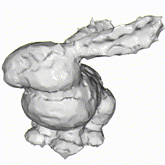
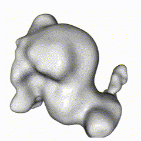
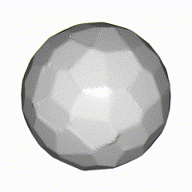

# 3D Surface Reconstruction with Implicit Functions





# Overview

This project focuses on implicit surface reconstruction using two techniques:

- **Hoppe’s Method**: This technique uses tangent planes calculated from point normals to estimate signed distances from query points.
- **Triharmonic Radial Basis Functions (RBFs)**: This approach employs polyharmonic kernels (specifically the triharmonic kernel `phi(r) = r^3`) to interpolate the surface from on- and off-surface constraints.

Both methods are implemented in a fully vectorized manner using NumPy and other scientific libraries.

---

## Dependencies

Ensure you have the required Python libraries installed:

```bash
pip install open3d scikit-image
```

These libraries work alongside standard packages such as NumPy and SciPy.

---

## Usage

Run the reconstruction pipeline from the command line:

```bash
python main.py --input_path INPUT_PATH /
               --mesh_save_path SAVE_PATH /
               --mode METHOD
```

**Parameters:**

- **`INPUT_PATH`**: Path to the input file (e.g., a `.npz` file) containing points and normals.
- **`SAVE_PATH`**: Destination path for the output mesh.
- **`METHOD`**: Reconstruction method to be used. Choose between `hoppe` or `rbf`.

An optional flag, `--show_input_only`, allows you to visualize just the input point cloud, which is useful for debugging.

---

## Implementation Details

### Hoppe’s Method

Hoppe’s method estimates the signed distance for each query point relative to the nearest tangent plane. The steps are:

1. **Closest Point Search**: For each query point, find the closest sample point in the point cloud.
2. **Distance Calculation**: Compute the signed distance from the query point to the tangent plane defined by the closest sample point and its normal.
3. **Vectorization**: All operations are implemented using vectorized NumPy routines to ensure efficiency without any explicit loops.

---

### Triharmonic Radial Basis Functions

The RBF method constructs an implicit function whose zero level set defines the surface. It involves:

1. **Constraint Generation**: Augment the original point set with off-surface points along the normals (both positive and negative offsets).  
   - **On-Surface**: /(f(p) = 0/)
   - **Off-Surface**: /(f(p /pm /epsilon n) = /pm /epsilon/), where /(/epsilon/) is a small offset derived from the bounding box of the point cloud.
2. **Matrix Setup**: Build the system matrix /(M/) using the triharmonic kernel /( /phi(r)=r^3 /), where /(r/) is the distance between each constraint point and the RBF centers.
3. **Solve for Weights**: Solve the over-determined linear system /(M /cdot /text{weights} = d/) in a least-squares sense to obtain the RBF weights.
4. **Evaluation**: Compute the signed distance at query points as a weighted sum of the kernel evaluations.

---

## Project Structure

```plaintext
├── main.py                # Main executable script
├── implicit_hoppe.py      # Implementation of Hoppe's method
├── implicit_rbf.py        # Implementation of the RBF method
├── assets/
│   └── computed_gifs/
│       ├── bunny_500_hoppe.png  # Example output from Hoppe’s method
│       └── bunny_500_rbf.png    # Example output from RBF method
└── README.md              # This file
```

---

## References

- **Hoppe, H., DeRose, T., Duchamp, T., McDonald, J., & Stuetzle, W. (1992).** Surface Reconstruction from Unorganized Points. *ACM SIGGRAPH Computer Graphics*, 26(2), 71–78. [Link](https://dl.acm.org/doi/10.1145/142920.134011)
- **Carr, J. C., Beatson, R. K., Cherrie, J. B., Mitchell, T. J., Fright, W. R., McCallum, B. C., & Evans, T. R. (2001).** Reconstruction and Representation of 3D Objects with Radial Basis Functions. *SIGGRAPH '01*, 67–76.

