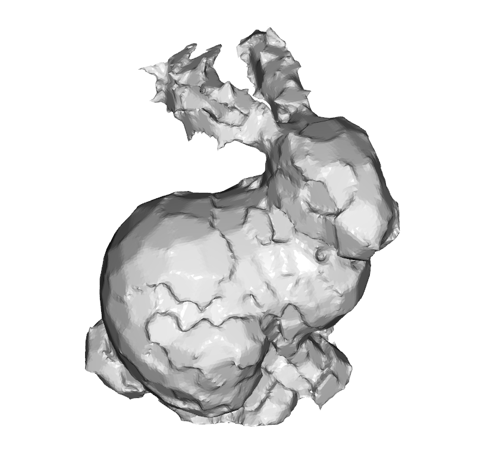
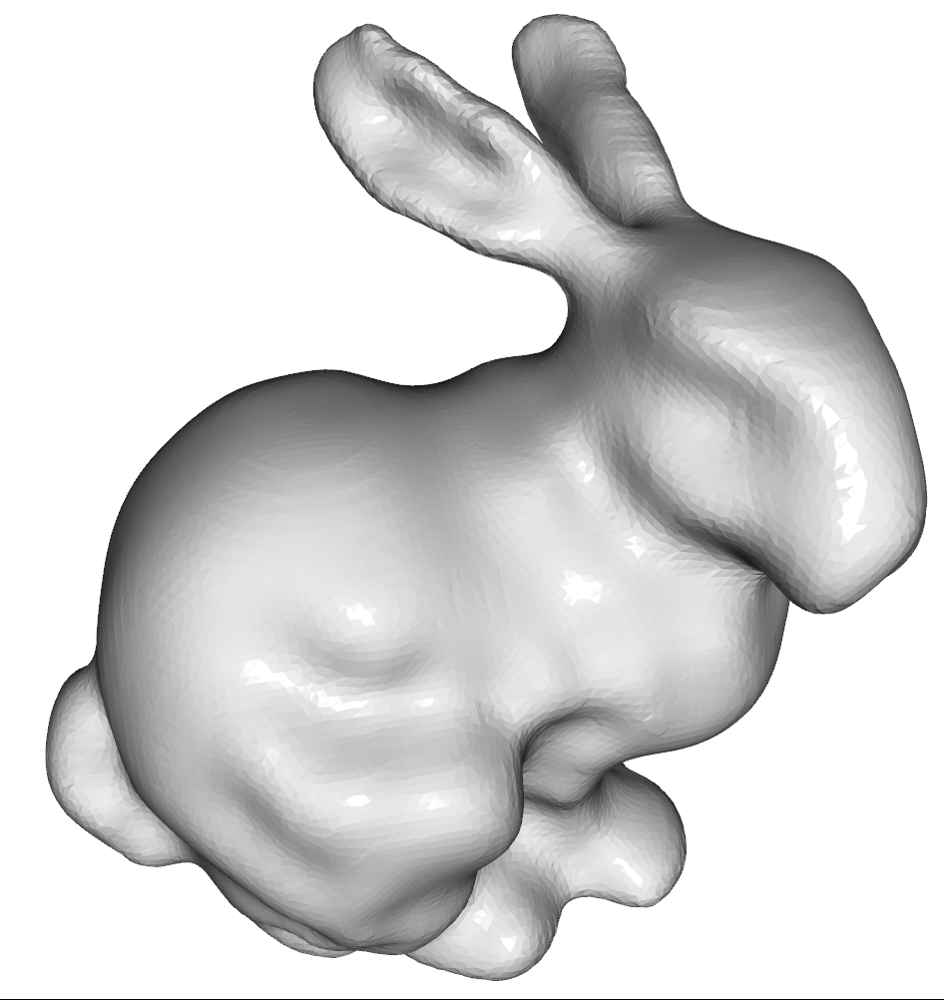

# Assignment #6
## Introduction
The aim of this exercise sheet is to make yourself familiar with surface reconstruction.
The provided template already outlines the reconstruction process; your task is to complete it by implementing a signed distance function for implicit surface reconstruction using two methods:
- Hoppe distance from tangent planes [Hoppe 92]
- Triharmonic Radial Basis Functions (RBFs)

## Dependencies
Beside other libraries installed in previous assignments, this assignment requires a few additional libraries including Open3D and Scikit-image. These libraries can be easily installed using pip:
```
pip install open3d scikit-image
```

## Compiling Your Code and Run
To compile the code, use the following script:
```
python main.py --input_path INPUT_PATH \
               --mesh_save_path SAVE_PATH \
               --mode METHOD \
```
where `INPUT_PATH` is the input files (which consists of points and normals), `SAVE_PATH` is the path to save the output mesh, and `METHOD` which is either `hoppe` or `rbf` is the algorithm that will be used. There is another optional flag `--show_input_only` which let you visualize the input for debugging purpose. You can also use the `run.sh` script to run the program (remember to change the `OBJECT` and `METHOD` variables).

## Tasks
In this assignment, you have to implement two implicit 3D surface reconstruction algorithms, including Hoope distance from tangent planes and Triharmonic Radial Basis Functions.
#### Task 6.1: Hoppe distance from tangent planes
- Your task is to complete the `ImplicitHoppe.__call__` function in `implicit_hoppe.py`.
- Firstly, given a set of input points `p` with shape `Nx3`, you have to find the closest sample point for each point in `P`.
- After that, calculating the distances `dist` from points `P` to closet tangent plane.
- Return that calculated distance, which has the shape of `N`.
- You are required to vectorize the whole process using numpy for efficiency purposes. Please do not use any for-loop in the code, otherwise you will get score deduction.
- The results of this task should look like this:


#### Task 6.2: Triharmonic Radial Basis Functions
- Your task is to complete the `ImplicitRBF.__init__` and `ImplicitRBF.__call__` in `implicit_rbf.py`
- In the init method, your goal here is to form a correct matrices `M`, `weights`, and `d` using on- and off- surface constraints. The final outcome of this method is to calculate the vector `self._weights` which is the weights of the radial basis functions and will be used in the `__call__` method later.
- In the `__call__` method, you need to calculate the signed distance values of a batch of points $P$. Again, you need to vectorize every operators and not using any for-loop here.
- The results of this task should look like this.


## Submission
- You need to submit your implementation, saved meshes for each pair of algorithms and inputs (2 algorithms and 3 inputs, so 6 output meshes).
